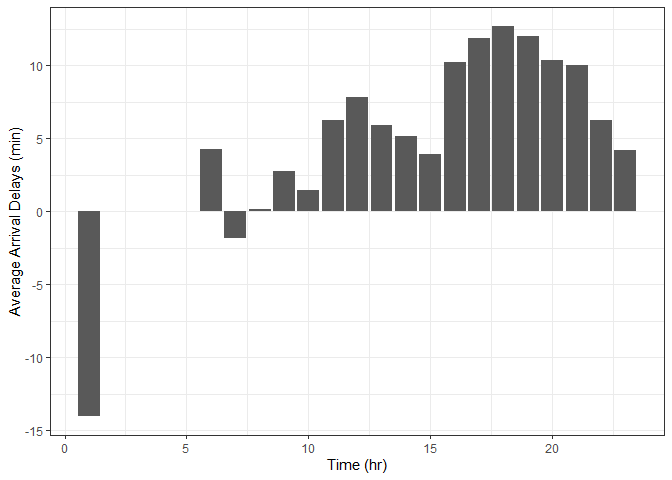
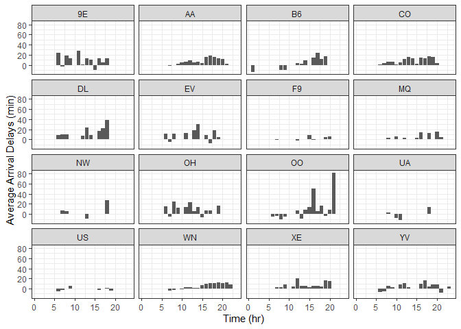
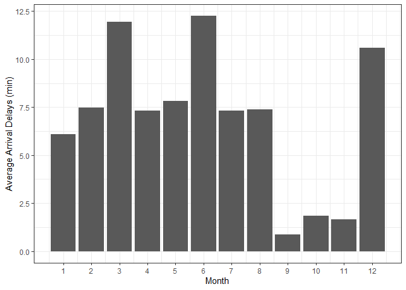
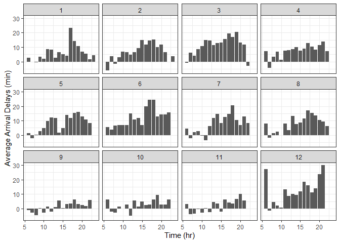
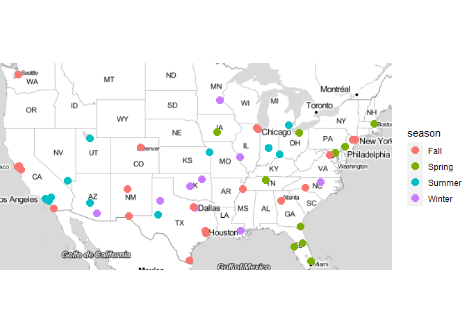
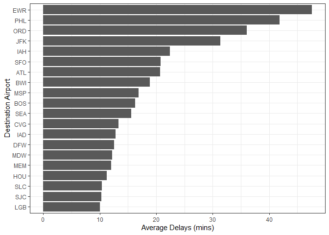
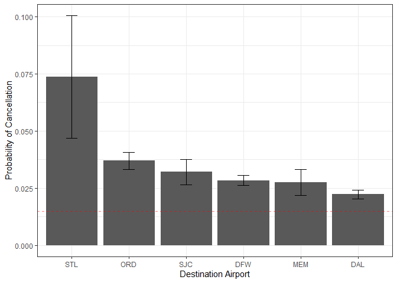
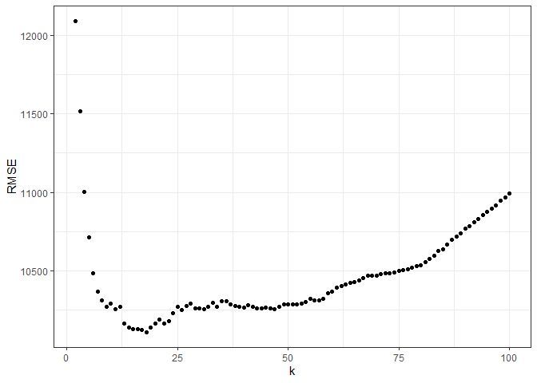
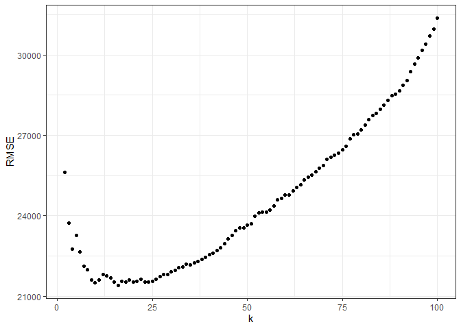
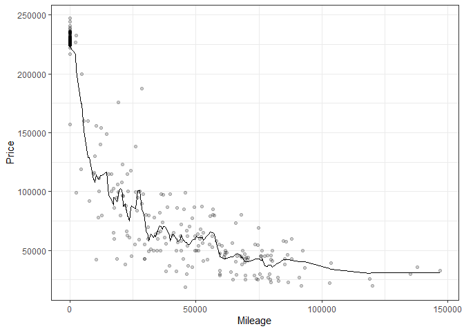

# Problem 1

Using this data set which contains information about every commercial
flight that either departed from or landed at Austin-Bergstrom
Interational Airport (ABIA) in 2008, we examined a number of statistics
with regards to flight patterns and delays of flights departing ABIA.

The graph below (Figure 1) shows the average arrival delays of every
flight that departed Austin in each hour of the day. We chose to analyse
arrival delays instead of departure delays because arrival delays also
incorporate information about time spent in the air. From the figure, it
appears that there are two peaks: at noon and around 6 in the afternoon.
To minimize delay time, flying in the morning or during the late night
can be a good choice.

Average Arrival Delays of Each Hour of the Day

The times of delays do differ among carriers, however. The graph below
(Figure 2) shows similar statistics as those shown in the previous
graph, but for each airlines present in the data set. The patterns of
delays are quite varied across the airlines: it appears that there are
airlines such as US Airways, United, and Frontier that do not experience
many delays at all, while there are airlines like Colorado and American
that tend to experience longer delays during the day. But, in general,
mornings and late nights tend to have shorter delays.

Average Arrival Delays for Different Airlines

Delay times also change throughout the year. Below is the graph of
average arrival delays in each month of 2008 for the 12 most popular
destinations (Figure 3), which include DAL, DFW, IAH, PHX, DEN, ORD,
HOU, ATL, LAX, JFK, ELP, and LAS. It appears that autumn (September to
November) is the best time fly to these places.

Average Arrival Delays for Each Month

Then, for each month, we again plotted the average delays for each hour
for these destinations (Figure 4). The graph conforms with what we found
previously, that early hours tend to experience shorter delays than
later hours do.

Average Arrival Delays for Each Month at Different Times of the Day

We have also mapped out the seasons in which the shortest delay time
occurs at each destination airport. From the map (Figure 5), airports
where spring has minimal delay are concentrated on the east coast;
airports where winter has minimal delay are concentrated in the south.
The overall pattern is not exactly clear though, but it does seem that
the best time to fly to Florida is spring.

Mininal Aaverage Delay Season for Each Airport

Having examined the best time to fly out of ABIA, we turn to the
destination airports themselves. The graph below (Figure 6) shows the
destination airports with the longest average delays that were
attributed to weather and NAS reasons (which include non-extreme weather
conditions, airport operations, heavy traffic volume, and air traffic
control), with a minimum cutoff at 10 minutes. We believe these two
reasons are idiosyncratic to the airports themselves and can be
indications of their certain qualities. The airports that suffer from
the longest delays according to the figure include NYC airports,
Philadelphia International Airport, and Chicago O’Hare.

Average Delays Due to Weather and NAS

We then picked out the 8 airports with the longest delays, and plotted
their average delays (that are due to weather and NAS) for each month
(Figure 7). Some of these airports, like JFK and IAH have consistent
delays throughout the year, while airports such as Baltimore-Washington
and Philadelphia have their significant delays occurring only in certain
months of the year.

Average Delays Due to Weather and NAS for Different Airports

Lastly, we calculated the likelihood of cancellations of flights to
different destinations (we restricted our analysis to the airports to
which there were at least 30 flights from ABIA), and computed their
standard errors. We find that 6 airports (shown in Figure 8) receive a
statistically significantly higher likelihood of cancelled flights
compared to the baseline cancellation rate that is calculated from all
flights leaving Austin. Among these destinations, Lambert-St. Louis
International Airport is the worst. (We also examined at the probability
of diverted flights but did not find any statistical significance.)

Probability of Flight Cancellations for Different Destination Airports

In summary, the best time to fly out of Austin is in the autumn months
or during the morning hours (at least to the most popular destinations).
Among the popular destinations, JFK, Chicago O’Hare, and George Bush
Intercontinental Airport see the longest average delays. Furthermore,
Lambert-St. Louis and Chicago O’Hare experience much higher chances of
flight cancellations than normal.

# Problem 2

## Part a

The 95th percentile of heights for female competitors across all
Athletics events is 183 cm.

## Part b

<table class="table" style="margin-left: auto; margin-right: auto;">
<caption>
Women’s Event with Largest Variabilities in Heights
</caption>
<thead>
<tr>
<th style="text-align:left;font-weight: bold;">
Event
</th>
<th style="text-align:right;font-weight: bold;">
SD
</th>
</tr>
</thead>
<tbody>
<tr>
<td style="text-align:left;">
Rowing Women’s Coxed Fours
</td>
<td style="text-align:right;">
10.87
</td>
</tr>
<tr>
<td style="text-align:left;">
Basketball Women’s Basketball
</td>
<td style="text-align:right;">
9.70
</td>
</tr>
<tr>
<td style="text-align:left;">
Rowing Women’s Coxed Quadruple Sculls
</td>
<td style="text-align:right;">
9.25
</td>
</tr>
<tr>
<td style="text-align:left;">
Rowing Women’s Coxed Eights
</td>
<td style="text-align:right;">
8.74
</td>
</tr>
<tr>
<td style="text-align:left;">
Swimming Women’s 100 metres Butterfly
</td>
<td style="text-align:right;">
8.13
</td>
</tr>
<tr>
<td style="text-align:left;">
Volleyball Women’s Volleyball
</td>
<td style="text-align:right;">
8.10
</td>
</tr>
</tbody>
</table>

Shown in Table 1 are the top 6 women’s events with the greatest
variability in competitors’ heights, measured in standard deviations.

From the table, Rowing Women’s Coxed Fours has the greatest variability
in competitor’s heights, with a standard deviation of 10.87. (If the
question is asking “single women”, then it is Swimming Women’s 100
metres Butterfly with a standard deviation of 8.13.)

## Part c

Average Age of Olympic Swimmers by Year

The average age of Olympic swimmers was around 18 in the start of the
20th century, with a trend upwards until the 1920s when female swimmers
started participating in swimming events. Between 1920s and 1980s, the
average ages of swimmers of both genders remain relatively flat. Then
beginning in 1980s, the average ages of both male and female swimmers
began to rise, and female swimmers are consistently younger than male
swimmers on average.

# Problem 3

For each trim (“350” and “65 AMG”), the data were first randomly divided
into 10 folds (9 of them are used as training sets, and the remaining
one a testing set), and KNN regressions were performed 10 times on each
data set for each k value ranging from 2 to 100. Root mean-squared
errors of each regression model was then computed against the testing
set, and an average RMSE value was computed for each k value. These
values are plotted below (Figures 10 and 12).

## 350 AMG

RMSE of KNN Model at Various Values of k

Based on the Figure 10, it appears that the optimal (least) RMSE value
occurs around a k value of 16. Using this k value, a KNN regression was
again performed on the entire sub-data set, and the predicted values
along with the raw data points are plotted below (Figure 11).

Prediction of KNN Model with k=16

## 65 AMG

RMSE of KNN Model at Various Values of k

Based on Figure 12, it appears that the optimal (least) RMSE value
occurs around a k value of 10. Using this k value, a KNN regression was
again performed on the entire sub-data set, and the predicted values
along with the raw data points are plotted below (Figure 13).

Prediction of KNN Model with k=10

The optimal k value is larger for the “350” trim. This is likely because
there are more data point in this trim, and the points in “350” trim are
closer to each other, while those in “65 AMG” are more scattered; so,
KNN can utilize more neighboring points to make predictions for the
“350” trim without sacrificing accuracy. However, despite these
differences, the optimal k values are still fairly close to each other;
this is perhaps because of the clustering in “350” trim’s distribution.
